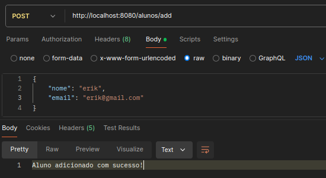
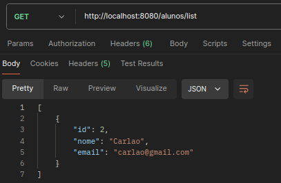
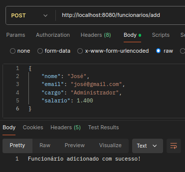
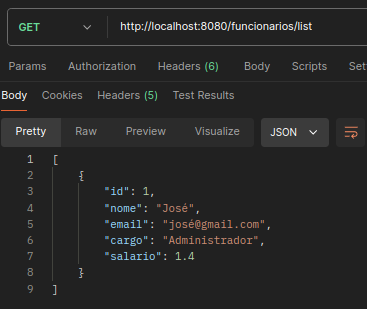

# API de inserção e visualização de alunos e funcionários
- - -
## Tecnologias utilizadas
- Java Spring Boot
  - Spring Boot JPA
  - Spring Boot Devtools
  - Lombok
  - PostgreSQL

- - -
## Estrutura de pastas

A estruturação de pastas segue a lógica do MVC, porém sendo aplicado de maneira mais simples.

- **Controller**: Recebe as requisições da API e retorna uma response de acordo com a requisição.
- **Model**: Modelagem das entidades do banco de dados [ Aluno, Funcionário ].
- **Repository**: Contém a lógica de acesso ao banco de dados.

- - -

## Configuração do banco de dados
No arquivo **application.properties**, é necessário inserir as informações referentes
ao seu banco de dados.

```properties
# URL de conexão
spring.datasource.url=jdbc:postgresql://localhost:5432/postgres
# User com acesso ao banco
spring.datasource.username=postgres
# Password do user
spring.datasource.password=12345678
```
- - -
## Build
No terminal, instale as dependências necessárias.
````bash
mvn clean install
````
Com isso, inicialize o projeto.
````bash
mvn spring-boot:run
````
- - -
## Evidências de execução
Para enviar uma requisição, o body precisa seguir o padrão estabelecido.

### Aluno
````json
{                                                                                                                       
    "nome": "nome example",
    "email": "email@example.com"
}
````
### Funcionário
````json
{
    "nome": "nome example",
    "email": "email@example.com",
    "cargo": "admin",
    "salario": 2.500
}
````

### Requisição no postman
#### Inserção de aluno
**- POST: http://localhost:8080/alunos/add** \


**- GET: http://localhost:8080/alunos/list** \

- - -
#### Inserção de funcionário
**- POST: http://localhost:8080/funcionarios/add** \


**- GET: http://localhost:8080/funcionarios/list** \
